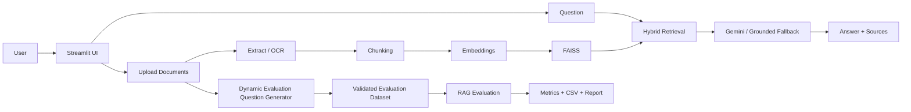

Universal Document Q&A Assistant — Dynamic RAG Evaluation
A Streamlit-based universal document Q&A system with OCR, embeddings, FAISS hybrid retrieval, Gemini multimodal answers, source locations, conversation history, prompt-injection protection, and dynamic RAG evaluation generated from the documents currently uploaded by the user.
Main features
Multiple uploads: PDF, scanned PDF, DOCX, TXT, PPTX, XLSX, CSV, JPG/JPEG/PNG/WEBP
OCR for scanned/image documents
Sentence-transformer embeddings + FAISS
Hybrid lexical + semantic retrieval
Gemini grounded answers with original image support
Conversation history and source locations
Prompt-injection protection
Deterministic grounded fallback when Gemini is temporarily unavailable
Configurable chunking:
Small: 500 / 80
Balanced: 850 / 140
Large: 1200 / 180
Duplicate question submission protection
Latest document result remains visible during evaluation
Dynamic RAG Evaluation
The evaluation is not tied to Malka Noor, Employees.csv, or the old 25-question test set.
Upload and process the document(s) you actually want to evaluate.
Open Project 4 RAG Evaluation.
The app asks how many questions you want, from 1 to 200.
Choose either:
Entire uploaded document(s) — questions cover the whole processed document collection.
A specific topic/detail — questions are restricted to the topic you enter.
Click Generate Evaluation Questions.
The app generates source-grounded questions and validates every question against actual extracted document evidence.
Download the generated evaluation CSV.
Run the RAG evaluation against the same uploaded documents.
Important accuracy rule
The app must not invent facts just to reach the requested number. If Gemini is unavailable or the document does not contain enough distinct supportable facts, the app uses validated source-line question variants where possible and otherwise reports the actual number it could support.
For example, if you enter 125, the app attempts to produce 125 questions. Every question must be traceable to actual content in the uploaded documents. It will never invent a source, page, measurement, name, date, or other fact.
Evaluation isolation
A normal user query such as Awais against `Employees.csv` remains normal document Q&A. It does not become part of the evaluation dataset unless `Employees.csv` is the document currently selected/uploaded for evaluation.
Metrics
Retrieval Hit Rate
Answer Keyword Coverage
Combined Evaluation Score
Default evaluation mode is fast and grounded. The optional Gemini-answer mode is slower because it sends each evaluation question to Gemini.
Architecture

Run
```bash
pip install -r requirements.txt
streamlit run app.py
```
For scanned PDFs/images, install Tesseract OCR on the host.
Streamlit
Add `GEMINI_API_KEY` to Streamlit Secrets. Never put the API key in GitHub source code.
