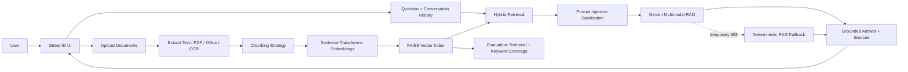

# Universal Document Q&A Assistant — Production-Style RAG

A Streamlit-based document question-answering system that combines document extraction, OCR, embeddings, vector search, RAG prompting, conversation history, source citations, prompt-injection protection, and evaluation.

## What it supports

- Multiple document uploads in one session
- PDF and scanned PDF processing
- DOCX, TXT, PPTX, XLSX, CSV
- JPG, JPEG, PNG, WEBP image documents
- OCR with Tesseract for scanned/image content
- Gemini multimodal vision as a supplemental image transcription layer
- Configurable chunking strategies:
  - Balanced (850 / 140)
  - Small (500 / 80)
  - Large (1200 / 180)
- Sentence-transformer embeddings
- FAISS vector database
- Hybrid lexical + semantic retrieval
- RAG-grounded Gemini answer generation
- Original image bytes supplied to Gemini for image questions
- Conversation history
- Source/document/page display
- Prompt-injection detection and context sanitization
- Deterministic grounded fallback when Gemini is temporarily unavailable
- 25-question evaluation mode with retrieval-hit rate and keyword coverage
- Downloadable evaluation CSV and report

## Architecture



## RAG flow

1. Upload 5–10 or more documents.
2. Extract text and OCR scanned/image content.
3. Split content using the selected chunking strategy.
4. Create embeddings with `all-MiniLM-L6-v2`.
5. Store vectors in FAISS.
6. Retrieve relevant chunks using lexical and semantic signals.
7. Sanitize retrieved context against prompt injection.
8. Send question + retrieved context + conversation history to Gemini.
9. For image sources, also send the original image bytes to the multimodal model.
10. Return the answer together with document/page/source references.
11. If Gemini is temporarily unavailable, return a grounded extractive RAG answer instead of crashing.

## Chunking comparison

| Strategy | Chunk size | Overlap | Typical use |
|---|---:|---:|---|
| Small | 500 | 80 | Precise short facts |
| Balanced | 850 | 140 | General-purpose RAG |
| Large | 1200 | 180 | Context-heavy documents |

Use the same evaluation dataset with each strategy and compare retrieval hit rate and answer keyword coverage.

## Evaluation

The chatbot itself is universal: it is not tied to any property, company, university, or other domain.

The repository includes a separate neutral evaluation corpus in `evaluation_demo/` and a 25-question ground-truth dataset in `rag_evaluation_25_questions.csv`. The demo corpus covers company policy, university guidance, a product manual, travel information, and RAG technical notes. This corpus exists only to demonstrate the evaluation methodology; it is not hardcoded into normal document Q&A.

For a final university report, you can replace the evaluation CSV with 20–30 questions based on your own project documents using the same columns.

Required CSV columns:

- `id`
- `question`
- `source_file`
- `expected_location`
- `expected_answer_keywords`

Metrics shown by the app:

- Retrieval Hit Rate
- Answer Keyword Coverage
- Combined Evaluation Score

These are simple project-level metrics, not a substitute for human evaluation.

## Run locally

```bash
pip install -r requirements.txt
streamlit run app.py
```

For scanned PDFs/images, install Tesseract OCR and the required language packages on the host.

## Streamlit deployment

1. Push `app.py`, `requirements.txt`, `packages.txt`, `rag_evaluation_25_questions.csv`, `README.md`, and the `evaluation_demo/` folder to GitHub.
2. Create a Streamlit Community Cloud app from the repository.
3. Add `GEMINI_API_KEY` in Streamlit Secrets.
4. Deploy/reboot the app.

Do **not** put the Gemini API key inside GitHub source code.

## Gemini availability behavior

The app uses current Gemini Flash-family model IDs. Gemini service capacity errors such as HTTP 503 are external availability conditions. The application therefore tries configured current models and then falls back to grounded document extraction so a temporary Gemini outage does not make the entire RAG demo unusable.
